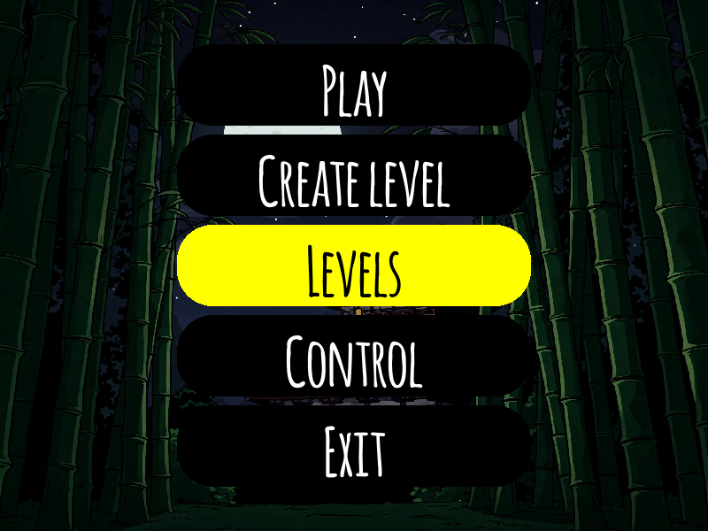

# Sky Hero

Sky Hero is a 2D platformer built with **Pygame**. Guide your hero through a series of challenging levels or design your own using the built‑in map editor.

## Features

- Classic platforming mechanics: run, jump and attack your way through enemies.
- Multiple levels with a short tutorial and final credit sequence.
- Custom level editor for creating your own maps.
- Configurable keyboard controls stored locally.

## Requirements

- Python 3.7+
- [Pygame](https://www.pygame.org/)

Install dependencies with:

```bash
pip install pygame
```

## Running the Game

Launch the main game window with:

```bash
python game.py
```

## Controls

- **Arrows** – movement
- **Space** – jump
- **X** – attack

You can redefine keys in the settings menu.

## Screenshots

<!-- Insert a screenshot of the main menu -->



<!-- Insert a short gameplay GIF -->


